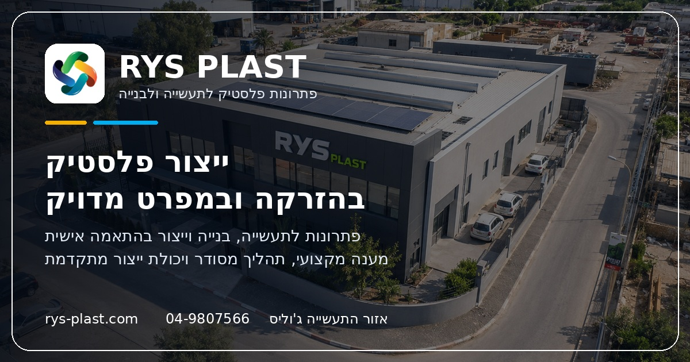

# RYS Plast — Website

> A modern, Hebrew RTL marketing website for **RYS Plast**, an Israeli plastic manufacturing factory. The site presents plastic injection capabilities, industrial and construction products, machinery, the Unidome solution, and direct contact paths for business inquiries.

[](#)
[](#)
[](#)
[](#)
[](#)
[](#)

---

## Preview



---

## 1. Project Overview

`rys-v1` is the production website for **RYS Plast**, a plastic manufacturing factory based in the Julis industrial area, Israel. It is a fully static, hand-built site (no framework, no CMS) optimized for Hebrew RTL, B2B clarity, and search/answer-engine visibility.

The site is intentionally lightweight: HTML/CSS/Vanilla JS only — no build step, no bundler, no runtime dependencies — which keeps deployment simple and load time fast.

---

## 2. Main Objectives

- Present the factory's plastic-injection capabilities to industrial and construction buyers.
- Surface the **Unidome** product as a dedicated landing experience without polluting the main brand system.
- Capture qualified inquiries through a focused contact form.
- Be discoverable in Hebrew local search, AI answer engines, and social shares.
- Stay easy to maintain by anyone who can edit HTML.

---

## 3. Tech Stack

| Layer            | Tech                                                                                     |
| ---------------- | ---------------------------------------------------------------------------------------- |
| Markup           |           |
| Styling          |              |
| Behavior         |      |
| Routing          |  |
| Hosting model    |                            |
| Discoverability  | SEO metadata · Open Graph · Twitter Cards · `sitemap.xml` · JSON-LD                      |
| Type             | Static, no backend, no build step                                                        |

> **Not used:** React, Next.js, Tailwind, WordPress, Node.js, any backend, any database.

---

## 4. Pages

| Page                  | File                  | Clean URL          | Purpose                                                            |
| --------------------- | --------------------- | ------------------ | ------------------------------------------------------------------ |
| Homepage              | `index.html`          | `/`                | Hero, capabilities overview, factory FAQ schema                    |
| About                 | `about.html`          | `/about`           | Company story, values, work method, leadership, gallery            |
| Products & Services   | `services-products.html` | `/services-products` | Manufacturing services and product catalog                      |
| Machines              | `machines.html`       | `/machines`        | 12-machine injection lineup, tonnages, capability cards            |
| Unidome               | `unidome.html`        | `/unidome`         | Standalone landing page for the Unidome construction product       |
| Contact               | `contact.html`        | `/contact`         | Contact channels, form, factory credibility, submission checklist  |
| Privacy Policy        | `privacy-policy.html` | `/privacy-policy`  | Practical website privacy text (legal review pending)              |
| Terms of Use          | `terms-of-use.html`   | `/terms-of-use`    | Practical website terms text (legal review pending)                |
| Custom 404            | `404.html`            | served on 404      | Branded recovery page with helpful internal links                  |

---

## 5. Key Features

- **Hebrew RTL** layout end-to-end, with proper logical-property CSS (`inset-inline-start`, etc.).
- **Industrial B2B design system** — shared header, footer, buttons, cards, hero rhythm, reveal effects.
- **Unidome landing** — visually distinct, scoped via `unidome-styles.css` so it doesn't bleed into the main site.
- **Machines page** — 12 injection machines with capability ribbon, capacity grid, and capability chips.
- **SEO / GEO / AEO** metadata — canonical, OG, Twitter, theme-color, JSON-LD `Organization` + `WebSite` + `FAQPage` + `ContactPage`, sitemap, clean URLs.
- **Clean URL routing** via `.htaccess` — `/about` instead of `/about.html`, with `index.html → /` redirect.
- **`sitemap.xml`** — 8 indexable URLs, weighted by commercial intent.
- **Favicon set** — `.ico`, 16/32/192/512, apple-touch, web manifest.
- **Open Graph share image** — `assets/og/rys-og-image.jpg` (1200×630).
- **Accessibility widget** — floating button + panel with text size, grayscale, high contrast, link highlighting; preferences persist via `localStorage`. *Not* a formal compliance certification.
- **Cookie consent banner** — appears once, two clear options (`accept` / `essential`), preference persists, links to Privacy Policy.
- **Contact form UI** — short, professional, frontend-ready (wire to your form handler at deploy).

---

## 6. Production Assets

```
assets/
├── favicon/
│   ├── favicon.ico
│   ├── favicon-16x16.png
│   ├── favicon-32x32.png
│   ├── favicon-192x192.png
│   ├── favicon-512x512.png
│   ├── apple-touch-icon.png
│   └── site.webmanifest
└── og/
    └── rys-og-image.jpg     # 1200×630 social share image
```

Plus all factory, machine, product, leadership, and Unidome imagery under `assets/`, `assets/machines/`, and `assets/unidome/`.

---

## 7. Folder Structure

```
rys-v1/
├── .htaccess                  # clean URLs + 404 handler
├── .gitignore
├── README.md                  # this file
├── cro-seo-aeo-audit.md       # production-readiness audit notes
├── sitemap.xml
│
├── index.html
├── about.html
├── services-products.html
├── machines.html
├── unidome.html
├── contact.html
├── privacy-policy.html
├── terms-of-use.html
├── 404.html
│
├── styles.css                 # main design system
├── unidome-styles.css         # scoped Unidome page only
├── script.js                  # nav, reveal, form, a11y widget, cookie banner
│
└── assets/
    ├── favicon/               # full favicon + manifest set
    ├── og/                    # Open Graph share image
    ├── machines/              # 12 injection machine renders
    ├── unidome/               # Unidome product imagery
    ├── about-*.jpg            # company / team imagery
    ├── factory-floor.jpg
    ├── contact-hero.jpg
    ├── injection-mach.png
    ├── products*.{png,jpg}
    └── ...
```

---

## 8. SEO / GEO / AEO Notes

**SEO**
- Per-page `<title>`, `<meta description>`, canonical, `robots`, `theme-color`.
- Open Graph: `og:type`, `og:locale`, `og:site_name`, `og:title`, `og:description`, `og:url`, `og:image` (+ `width`, `height`, `alt`).
- Twitter: `summary_large_image` card with image.
- `sitemap.xml` — clean URLs, priorities reflect commercial intent (home `1.0`, services-products + contact `0.9`, unidome `0.85`, machines `0.8`, about `0.7`, legal `0.3`).

**GEO (local)**
- JSON-LD `Organization` with `PostalAddress` (Julis industrial area), `telephone`, `email`, `areaServed: IL`.
- Address, phone, and email surfaced in the footer of every page.

**AEO (answer engines)**
- Visible Q&A blocks paired with `FAQPage` JSON-LD on the homepage.
- `ContactPage` schema on the contact page.
- Section headers structured as scannable answer chunks (Hebrew).

See `cro-seo-aeo-audit.md` for the full audit + A/B test recommendations.

---

## 9. Local Development

No build step, no install, no Node required.

**Quick view (any modern browser):**
```bash
open index.html
```

**Recommended (clean URLs work like production):**
```bash
# Python's built-in static server
python3 -m http.server 8000
# then visit http://localhost:8000
```

**For full clean-URL rewrites + custom 404**, run on Apache/MAMP/XAMPP locally so `.htaccess` is honored:
```bash
# example with MAMP htdocs
cp -r . /Applications/MAMP/htdocs/rys-v1
# visit http://localhost/rys-v1/
```

---

## 10. Deployment Notes

- **Host:** any Apache host with `mod_rewrite` and `AllowOverride All`.
- Upload the entire repo to the document root.
- Confirm:
  - `/contact`, `/about`, `/services-products`, `/unidome`, `/machines`, `/privacy-policy`, `/terms-of-use` return **200**.
  - `/contact.html` 301-redirects to `/contact`.
  - A non-existent URL serves the branded `404.html`.
  - Favicons load (check `/assets/favicon/favicon.ico` directly).
  - The OG image is reachable at `https://rys-plast.com/assets/og/rys-og-image.jpg`.
- After deploy, submit `sitemap.xml` to Google Search Console and Bing Webmaster Tools.
- HTTPS / `www`-redirect rules are intentionally **not** baked in — add them in `.htaccess` once SSL and the canonical host are confirmed.
- Wire the `<form id="contactForm">` in `contact.html` to your chosen form handler / backend (currently UI-only).

---

## 11. Contact Information

> **RYS Plast**
> Address: אזור התעשייה ג'וליס, כביש אלבנזין
> Phone: [04-9807566](tel:049807566)
> Email: [office@rys-plast.com](mailto:office@rys-plast.com)
> Website: <https://rys-plast.com/>

---

## 12. Important Notes

- **Privacy Policy** and **Terms of Use** are practical, website-ready pages. They should be reviewed by the client or legal advisor before launch. They do **not** claim formal regulatory compliance.
- The **accessibility widget** improves usability but does not replace a formal accessibility audit and is not a compliance certification.
- **Machine and product details** should only be changed after client approval.
- All production imagery is **served from the local repo** — no external image hotlinking.

---

## 13. Final QA Checklist

- [x] Every page has a unique title and meta description.
- [x] Favicon stack on every public page.
- [x] OG + Twitter card metadata on every public page.
- [x] Canonical clean URLs across the site.
- [x] `sitemap.xml` shipped with clean URLs.
- [x] `.htaccess` enforces clean URLs and a custom 404.
- [x] Privacy Policy + Terms of Use linked in every footer.
- [x] Cookie banner appears once and persists choice.
- [x] Accessibility widget is keyboard- and outside-click-dismissible, persists settings.
- [x] Machines page has the full **12-machine** lineup intact.
- [x] No external images hotlinked; all imagery is local.
- [x] Hebrew RTL preserved end-to-end; no horizontal overflow on mobile.
- [ ] Contact form wired to a backend or form-handler service *(deploy step)*.
- [ ] Privacy / Terms reviewed by legal *(client step)*.

---

## 14. Repository

🔗 **GitHub:** <https://github.com/admamr/rys-v1>

---

<sub>Crafted with care for RYS Plast · Hebrew RTL · Static · Clean.</sub>
